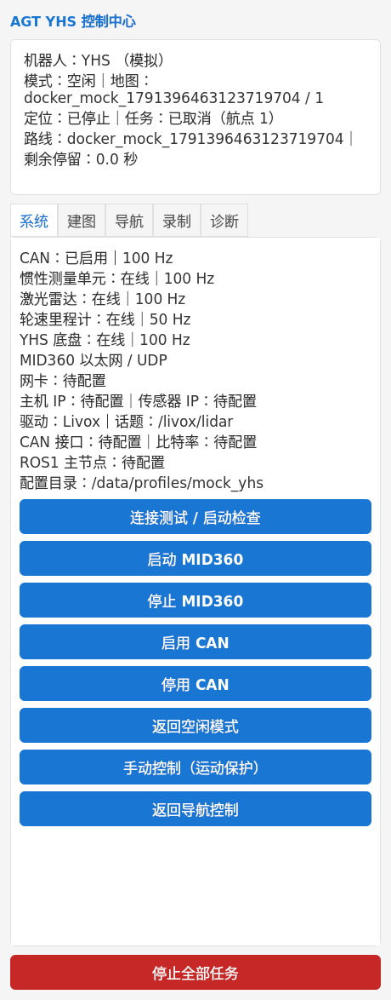

# AGT YHS Control 中文使用说明

这份说明用于 YHS Field Appliance V1。Qt 上位机使用本独立 fork；建图由 `agt-lio-pgo-mapping` 完成，定位导航由 `agt_navigation_v3` 完成。真实 YHS/CAN/MID360/外参/实车导航与安全验收仍为 **PENDING**。

## 1. 安装

普通现场操作人员从集成工程安装，不需要分别编译三个工程：

```bash
git clone --branch feature/yhs-field-appliance-v1 https://github.com/Aldoubt/agt_navigation_v3.git
cd agt_navigation_v3
./install.sh
```

前提：Linux 主机已安装 Docker Engine、Compose v2、Python3/PyYAML、xauth；操作员可以执行 `docker info`。目标现场主机是 ROS1 Noetic，容器内部是 ROS2 Humble。安装器会按固定 commit 取得 Mapping 和本 Qt fork，保留已有地图、路线与配置，生成 **AGT YHS Control** 桌面入口。

Qt 源码单独获取：

```bash
git clone --branch feature/yhs-field-appliance-v1 https://github.com/Aldoubt/agt_robot_hmi.git
```

仅启动 Qt 不等于启动机器人：Qt 需要集成工程的 Runtime、Map Bundle Manager、Mission Executor 和受控 gateway。不要直接把 Qt 速度话题连到 YHS driver。

## 2. 首次软件演示（没有硬件）

在集成工程目录运行：

```bash
./agt up --mock
```

没有桌面显示服务器时：

```bash
./agt up --mock --headless
PYTHONPATH=appliance python3 appliance/scripts/accept_mock_runtime.py --data-root "$HOME/agt"
./agt doctor --mock --report
```

Mock 数据只能在 Mock 模式激活。Mock 成功不代表真实 CAN、雷达、底盘或物理停机已经通过验收。停止：`./agt down`。

## 3. 实车前必须填写的配置

配置和数据在宿主机 `~/agt/`，修改 profile 不需要重新构建镜像。

| 内容 | 文件 / 目录 |
|---|---|
| YHS 型号、base/rotation/lidar/imu 帧、URDF 路径 | `~/agt/profiles/yhs/robot.yaml` |
| CAN interface/bitrate、ROS1 master、命令超时、driver watchdog | `~/agt/profiles/yhs/base.yaml` |
| 实际 ROS1 cmd_vel/odom/chassis/estop topics | `~/agt/profiles/yhs/topics.yaml` |
| 网卡、Host IP、MID360 IP、Livox JSON 文件路径 | `~/agt/profiles/yhs/sensors.yaml` |
| 外部 FAST-LIO calibration 文件路径 | `~/agt/profiles/yhs/localization.yaml` |
| PCD2Grid projection 配置路径 | `~/agt/profiles/yhs/mapping.yaml` |
| footprint、速度/加速度限制、自过滤尺寸 | `~/agt/profiles/yhs/navigation.yaml` |
| LiDAR/IMU 外参、底盘几何、标定版本与测量记录 | `~/agt/profiles/yhs/calibration/` |
| 实际 URDF | `~/agt/profiles/yhs/robot_description/urdf/` |
| meshes | `~/agt/profiles/yhs/robot_description/meshes/` |

所有 `null` / `CONFIG_REQUIRED` 都必须按实测填写。不要复制 Bunker 参数，不要只把标定状态改成 VERIFIED。FAST-LIO 配置模板及字段来源见集成工程 `profiles/yhs/templates/README.md`。

当前交付没有 YHS vendor driver。先取得并审计真实 ROS1 driver 的 CAN、topic、TF、方向和 watchdog。自定义 chassis/estop 消息须适配为 gateway 支持的 `std_msgs/String JSON` / `std_msgs/Bool`。未补标定和 verified watchdog 时，gateway 只监测、输出零速度。

完成配置后：

```bash
./agt down
./agt up
./agt doctor --report
```

初始未配置时 doctor 报 FAIL/CONFIG_REQUIRED 是预期行为。报告保存在 `~/agt/diagnostics/`；不会默认打包大型 rosbag。

## 4. 打开上位机

双击 **AGT YHS Control**，或在 Linux 桌面终端运行 `./agt up`。Launcher 封装 Runtime 检查、容器启动和 X11 授权；不需要手工 `xhost` 或 `source`。

上位机保留原有 QGraphicsView、地图、路径、机器人位姿、拓扑点、单点导航和 2D Pose Estimate，新增中文 YHS 控制面板，沿用主界面的浅色背景、蓝色圆角按钮与字体。页面内容支持滚动，红色“停止全部任务”按钮固定在底部。设备最近时间戳可将鼠标悬停在状态区查看；诊断页保留原始协议字段，便于排错。

控制面板分为：

- **系统**：传感器、CAN、YHS、wheel odom、Runtime 状态和受控启停。
- **建图**：Preflight、Start Mapping、Stop & Build Map、Review、Confirm、Activate。
- **导航**：选择地图、启动自动定位、路线保存/加载、任务控制。
- **录制**：开始/停止录制，显示持续时间、磁盘空间和 bag 路径。
- **诊断**：诊断与报告。

启动失败查看 `~/agt/logs/desktop-launch.log`，再执行 `./agt doctor --report`。不要在错误状态下反复发送运动命令。

## 5. 建图

1. “系统”页中检查 MID360 与 IMU；MID360 使用 Ethernet/UDP，直接进入 ROS2 Runtime，不设置串口。
2. “建图”页中填写新 Map Bundle ID 和 version，执行 **启动检查**。
3. 点击 **开始建图**，然后用已验收的物理遥控手动驾驶。Qt teleop 不会为了建图绕过现有定位门禁。
4. 点击 **停止并生成地图**。等待 clean finish、PGO、export、verification、localization assets、2D grid 全部完成；不要直接关闭容器代替 finish。
5. 点击 **审核地图（MapStudio）**，在现有 MapStudio 中处理 2D 地图、禁行区域和 refinement。
6. MapStudio 中 **Confirm & Save**，关闭 MapStudio，再回 Qt 点击 **确认并封存地图包**。
7. 看到 Mapping/Localization Assets/2D Map PASS、Review CONFIRMED 和 Bundle READY 后，点击 **激活地图**。

3D map、原始 keyframe patches 和 optimized poses 不被 2D 编辑修改。不要打开冻结文件直接改内容；需要变更时创建新版本。地图存放在 `~/agt/maps/<id>/<version>/`。

## 6. 定位与导航

1. “导航”页中 **刷新地图包**，选择 ID/version，**激活地图**。
2. 点击 **启动定位 / 进入导航模式**。
3. 等待 `RELOCALIZING → READY`。正常流程是自动 3D-BBS + GICP；已有 **2D Pose Estimate** 只作为 debug/fallback。
4. 未 READY、gateway 断连、错误 map hash/version 或资产缺失时，禁止开始任务。

**机器人当前位姿、路线第一个点、Manual Initial Pose 是三个不同概念。** 添加或移动路线第一个点不会修改机器人定位。

单点目标也交给 Mission Executor/Nav2，速度仍经过 Motion Guard。“手动控制（运动保护）”按钮只有在地图、定位和 gateway 门禁满足且没有活动任务时才可用。

## 7. 多航点与每点停顿

在已有导航目标表中添加点、编辑 X/Y/Yaw、调整顺序和 停留（秒），支持删除、保存、加载。

| 点 | 停留（秒） | Action |
|---|---:|---|
| P1 | 5 | wait |
| P2 | 20 | wait |
| P3 | 0 | wait |

Yaw 使用 **弧度**；停留（秒） 默认 0，必须是有限非负数。本版 Action 只支持 `wait`，没有机械臂任务。

先 **保存路线**，再 **开始任务**。路线持久化在 `~/agt/routes/`，绑定 Map Bundle ID/version/hash，不能在其他地图上静默执行。

执行顺序：Nav2 确认到达 P1 → 停车确认 → 等待 5 秒 → P2 → 等待 20 秒 → P3 → COMPLETED。

- **暂停**：取消当前导航目标，或暂停剩余 dwell。
- **继续**：重新检查地图、定位、gateway 和 cancellation barrier，再恢复。
- **取消**：结束本次任务，不继续下一个点。
- **停止全部任务**：停止受控任务和 Runtime 工作流；**不能替代物理急停**。

定位 LOST、Nav2 失败或 gateway 断连时，任务进入 ERROR，修复原因后重新加载/启动；不会自动跳过失败点。

## 8. 录制与诊断

Recording 中点击 **Start Recording / Stop Recording**。topics 来自 `topics.yaml`，bag 保存到 `~/agt/bags/`。建图 session 自身的原始录包由 Mapping Backend 管理。

常用命令：

```bash
./agt status
./agt logs
./agt doctor
./agt doctor --report
./agt down
```

CAN 受控操作为 `./agt can up` / `./agt can down`，bitrate 未配置时拒绝 up。授权不足时由现场管理员配置窄范围权限；Qt 不执行任意 shell。

删除容器不会删除 `~/agt/maps`、`routes`、`bags`、`logs`、`profiles` 或 `diagnostics`。

## 9. 实车验收顺序

按集成工程 `appliance/docs/real_robot_acceptance.md` 的 R0–R13 顺序：启动 → CAN 无运动 → chassis/odom → 低速方向 → TF/URDF → MID360/IMU → 静态定位 → 建图 → Bundle → 重定位 → 低速 Nav2 → 多点 dwell → Pause/Resume/Cancel → 30 分钟 endurance。

完整交接及明天的 12 个步骤见集成工程 `HANDOFF.md`；未知实车项目见 `appliance/docs/REAL_ROBOT_TODO.md`。

## 10. 开发人员说明与许可证

本 fork 的 YHS 分支基于 upstream `b0825e3cba3e7186cba8a6b83ff230be37c8b1fb`，保留 upstream LICENSE/attribution。LICENSE 文件是 GNU GPL Version 2 文本；分发前需单独审核许可证事实与义务，本说明不作法律兼容性结论。

Qt 构建依赖 ROS2/Qt5，完整环境由集成工程 Dockerfile 提供。开发模式使用 Dockerfile.dev，将本 fork mount 到 `/opt/hmi`，增量运行 `appliance/scripts/build_hmi.sh`。Qt 只调用稳定 Runtime API，不复制 Navigation Core 或 Mapping 算法。

## 界面更新验证（中文与 Qt 风格）

- 中文覆盖控制面板标题、五个页面、按钮、设备状态、定位/任务状态、航点表头与等待动作显示。地图/路线 ID、ROS topic、原始诊断 JSON 保留实际值。
- `wait` 仅显示为“等待”；路线文件仍保存 `action: wait`，地图绑定与任务门禁保持不变。
- 容器基础镜像安装 `fonts-noto-cjk`，主窗体使用已有字体选择逻辑并增加 Noto Sans CJK 回退。已有旧镜像须重新构建才能包含新字体和界面代码。
- 验证：Humble 容器内 Qt 主程序增量构建通过；`tests/field` CTest 通过；UID 1000 的 offscreen 实际程序截图检查通过。真实显示服务器、底盘和传感器验收仍待现场完成。


